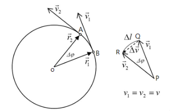

# Introduction

## Content

1. Atmospheric Continuum
2. Dimensions and Unit
3. Scale Analysis (Scaling)
4. Fundamental Forces
    * 4.1 Pressure Gradient Force
    * 4.2 Gravitational Force
    * 4.3 Viscous Force
5. Noninertial Reference System and Apparent force
    * 5.1 Noninertial Reference System
    * 5.2 Centripetal Force
    * 5.3 Coriolis Force
6. Statical Atmosphere Structure
    * 6.1 Hydrostatic Equation
    * 6.2 Pressure Coordinate System
    * 6.3 General Vertical Coordinate System

## 1. Atmospheric Continuum

1. Purpose of Continuum
    In dynamics meteorology, motion of individual particles can be ignored. Thus the atmosphere can be regarded as continuum.

2. Parcel
   * Common-used continuum in atmospheric scieces.
   * Feild variables in the parcel is a smooth
    function.

## 2. Domensions and Unit

1. Any equation in physics or other sciences always obey the principle of dimensional homogeneity.

2. In classical mechanics, there are few important fundamental quantities.
   | Quantity    | Unit     | Notation |
   | ----------- | -------- | -------- |
   | Length      | meter    | m        |
   | Mass        | kilogram | kg       |
   | Time        | seconds  | s        |
   | Temperature | Kelvin   | K        |

3. Derdivative quantities
  These quantities are derived from fundamental quantities, their units are also belonging to SI system.
  Some important derivative quantities likes below:
   | Quantity    | Unit   | Notation               |
   | ----------- | ------ | ---------------------- |
   | Frequency   | Hertz  | Hz (1/s)               |
   | Force       | Newton | N ($kg\cdot m/s^2$)    |
   | Pressure    | pascal | Pa ($kg/(m\cdot s^2)$) |
   | Temperature | Kelvin | K                      |

4. In real cases, these units may not so suitable for describing phenomenon, but the quantities always useful to describe them.

## 3. Scale Analysis (Scaling)

1. Purpose
    Due to the limitation of computing source, it's hard to computing all the factors in an equation. Therefore, it is neccessary to do scaling to simplify the computation.
2. In later chapters, this skill would be widely used, details will be described later.

## 4. Fundamental Forces

1. Body Force and Surface Force
   * Body Force
        Acting on the center of mass of an object, 
        proportional to the mass of the object.
        Gravity is an example of body force.
   * Surface Force
        Acting on the surface of the object,
        independent to the mass of the object.
        Pressure is an example of surface force.
2. Apparent Force
    In non-inertial coordinates, Newton's law should be rewritten with the factors of apparent force.
    In atmosphere, apparent forces like Coriolis force and centripetal force are examples.

### 4.1 Pressure Gradient Force (PGF)

Considering a parcel with its side length $\delta x, \delta y, \delta z$, and there is a pressure gradient on $x$ direction.
The pressure of the center of mass is suppoosed to be $p_0$.
The pressure of the two surface orthogonal to $x$ direction can be written as:
$$
\begin{aligned}
\begin{cases}
p_A = p_0+\delta p \\
p_B = p_0-\delta p
\end{cases}
\end{aligned}
$$

By Taylor's series, the equation can be written as:
$$
\begin{aligned}
\begin{cases}
p_A = p_0+\frac{\partial p}{\partial x} \frac{\delta x}{2} \\
p_B = p_0-\frac{\partial p}{\partial x} \frac{\delta x}{2}
\end{cases}
\end{aligned}
$$

Since the computation should be conducted with force, not pressure. So the expressions above need to be converted into:
$$
\begin{aligned}
\begin{cases}
\vec{F_A} = -(p_0+\frac{\partial p}{\partial x} \frac{\delta x}{2})\delta y\delta z \\
\vec{F_B} = (p_0-\frac{\partial p}{\partial x} \frac{\delta x}{2})\delta y\delta z
\end{cases}
\end{aligned}
$$

The reason why $\vec{F_A}$ is negative is due to its direction (point toward left).
Computing the total force, it will look like:
$$\Sigma\vec{F_x} = \vec{F_A}+\vec{F_B} = -\frac{\partial p}{\partial x}\delta x\delta y\delta z$$

Since $\delta x\delta y\delta z = \delta V$, the expression can be written as:
$$\Sigma\vec{F_x} = -\frac{\partial p}{\partial x}\delta V$$

By the second law of motion, the expression can be converted into:
$$\vec{a_x} = -\frac{1}{\rho}\frac{\partial p}{\partial x}$$

Without lossing the generalization, the expression can be extended to three dimension space.
The total function can be written:
$$\vec{a} = -\frac{1}{\rho}(\frac{\partial p}{\partial x}\hat{i}+\frac{\partial p}{\partial y}\hat{j}+\frac{\partial p}{\partial z}\hat{k})$$

By calculus, the expression can be written as:
$$\vec{a} = -\frac{1}{\rho}\nabla p$$

### 4.2 Gravitational Force

By Newton's gravitational force, the expression can be written as:
$$\vec{F_g} = -\frac{GMm}{r^2}(\frac{\vec{r}}{r})$$

Generally, in most of the cases, it will be written as gravitational acceleration:
$$\frac{\vec{F_g}}{m}\equiv \vec{g_0^*} = -\frac{GM}{r^2}(\frac{\vec{r}}{r})$$

If the object doesn't located at the surface, $r$ in the expression needs to be fixed into:
$$r = (a+z)$$

And the gravitational acceleration can be fixed into:
$$\vec{g^*} = \frac{\vec{g_0^*}}{(1+z/a)^2}$$

In most of the cases, vertical displacement can be ignored, since the order of magnitude of it much smaller than radius of the Earth.

### 4.3 Viscous Force

1. Cause 
    Shear stress is caused by the random motion of molecules, the motion diffusion is the primary cause of viscousity.
    This can cause momentum distribution in the parcel or fluid being more homogeneous.
2. Dervation
    By definition, viscous force can be written as:
    $$\vec{F} = \mu A \delta u/\delta z$$

    And also, the shear stress can be written as:
    $$\tau_{zx} = \lim_{\delta z \rightarrow 0} \mu\frac{\delta u}{\delta z} = \mu\frac{\partial u}{\partial z}$$

    $\mu$ in the expression is called dynamics viscosity coefficient, which is determined by the property of the fluid.

    By similar method used to derive PGF:
    define shear stress at the center of mass is $\tau_0$
    $$
    \begin{aligned}
    \begin{cases}
    \tau_{top} = (\tau_0+\frac{\partial \tau}{\partial z} \frac{\delta z}{2}) \\
    \tau_{bot} = -(\tau_0-\frac{\partial \tau}{\partial z} \frac{\delta z}{2})
    \end{cases}
    \end{aligned}
    $$

    Transforming shear stress into viscous force:
    $$
    \begin{aligned}
    \begin{cases}
    \vec{F_{top}} = (\tau_0+\frac{\partial \tau}{\partial z} \frac{\delta z}{2})\delta x\delta y \\
    \vec{F_{bot}} = (\tau_0-\frac{\partial \tau}{\partial z} \frac{\delta z}{2})\delta x\delta y
    \end{cases}
    \end{aligned}
    $$

    Combining the two force:
    $$\vec{F_{zx}} = \vec{F_{top}}-\vec{F_{top}} = \frac{\partial \tau_{zx}}{\partial z}\delta x\delta y\delta z$$

    Traansforming expression above into acceleration form:
    $$\vec{a_{zx}} = \frac{1}{\rho}\frac{\partial \tau_{zx}}{\partial z}$$

    By the definition of $\tau$, expression above can be written in:
    $$\vec{a_{zx}} = \frac{\mu}{\rho}\frac{\partial^2 u}{\partial z^2}$$

    Similarly, total acceleration on $x$ direction can be written in:
    $$\vec{a_x} = \frac{\mu}{\rho}[\frac{\partial^2 u}{\partial x^2}+\frac{\partial^2 u}{\partial y^2}+\frac{\partial^2 u}{\partial z^2}] = \nu \nabla^2 u$$

    The $\nu$ in the expression is kinematic viscosity coefficient.
    Generally, at the sea surface atmosphere, $\nu = 1.46\times 10^{-5} \ m^2\ s^{-1}$

    Also using the same method, the total expression in three dimensions can be written in:
    $$\vec{a} = \nu(\nabla^2 u\ \hat{i} + \nabla^2 v\ \hat{j} + \nabla^2 w\ \hat{k}) = \nu\nabla^2\vec{v}$$

## 5. Noninertial Reference System and Apparent force

### 5.1 Noninertial Reference System

1. inertial reference system

   * if the reference of a system doesn't obtain accleration, which means that it doesn't rotating and accelerated.
    Then the reference system of is inertial reference system, and all the physics laws can be used without any modifications.

2. non-inertial reference system

    * If the reference doesn't have the property likes above, then the system is called non-inertial reference system.
    * If physical laws need to be used, the apparent forces need to be added into calculation, in order to satisfied the laws.
    * Most of the cases, conservation law is described in geocentric reference frame, which is a non-inertial reference system.

### 5.2 Centripetal Force

Considering a object moving around a rotating axis with velocity $\vec{v}$.
When time $\delta t$ is passed, the velocity has changed $\vec{\delta v}$ like below.

By this image, there is:
$$\frac{d\vec{v}}{dt} = \vec{v}\frac{d\theta}{dt}(-\frac{\vec{r}}{r}) = -\omega^2 \vec{r}$$

This is called centripatel acceleration.
In rotating system, this force would be fixed into centrifugal force.
Mostly, this force will be combined with gravitational acceleration.
$$\vec{g}\equiv \vec{g^*}+\omega^2\vec{R}$$

After this fix, it can calculate the real gravitational force.
Since gravitational force is a conservative force, it can be written as a gradient value of gravitaitonal potential.
$$\nabla \Phi = -\vec{g}$$

### 5.3 Coriolis Force

1. **Zonal Motion**
   If the velocity on zonal motion is not zero, the centrifugal force will change due to the $\omega$ changing.
   It can be written like below:
   $$(\Omega+\frac{u}{R})^2\vec{R} = \Omega^2\vec R + 2\Omega u(\frac{\vec R}{R})+\frac{u^2}{R}(\frac{\vec{R}}{R})$$

   The first term on the right hand side is centrifugal force, which is combined with gravitational force.
   And the other 2 terms are Coriolis force, the latter one is due to the curvature of the Earth, which is much smaller than the middle one.
   The second term can be saperated into vertical and horizontal to the surface, it can be written in:
   $$
   \begin{aligned}
   \begin{cases}
   (\frac{dv}{dt})_{Co} = -2\Omega u sin(\phi) \\
   (\frac{dw}{dt})_{Co} = 2\Omega u cos(\phi) \\
   \end{cases}
   \end{aligned}
   $$

2. **Meridional Motion**
    The main cause is the conservation of angular momentum
    It can be written as:
    $$\Omega R^2 = (\Omega + \frac{\delta u}{R + \delta R})(R+\delta R)^2$$

    By simplified the expression:
    $$\delta u = -2\Omega \delta R = 2\Omega a \delta \phi sin(\phi_0)$$

    $$\Rightarrow (\frac{du}{dv})_{Co} = \lim_{\delta t\rightarrow 0}\frac{\delta u}{\delta t} = 2\Omega a\frac{d\phi}{dt}sin \phi_0 = 2\Omega vsin\phi$$

3. **Vertical Motion**
    By similar method, angular momentum must be conserved when the parcel is moving vertically.
    It'll cause:
    $$(\frac{du}{dt})_{Co} = -2\Omega w cos(\phi_0)$$

## 6. Statical Atmosphere Structure

### 6.1 Hydrostatic Equation

By hydrostatic equation:
$$\frac{\partial p}{\partial z} = -\rho g$$

This equation proves the concept of pressure and altitude has one to one relations.
By ideal gas law:
$$gdz = -\frac{dp}{\rho}$$

$$\Rightarrow d\Phi = -(\frac{RT}{p})dp = -RTd(ln(p))$$

$$\Rightarrow \Phi_2-\Phi_1 = R\int_{p_2}^{p_1} Td(ln(p))$$

This expression shows the thickness of geopotantial potential between $p_1$ and $p_2$.
By defining average scale height:
$$H = \frac{R<T>}{g_0}$$

The expression can be written as:
$$Z_T = Z_2-Z_1 = H ln(\frac{p_1}{p_2})$$

if $p_1$ is set at the surface level, the $Z$ can be written as:
$$Z = -H ln(\frac{p}{p_0})$$

### 6.2 Pressure Coordinate System

Consider the pressure gradients on $x$ direction $\frac{\partial p}{\partial x}$, and expand it with chain rule:
$$(\frac{\partial p}{\partial x})_z = (\frac{\partial p}{\partial z})_x (\frac{\partial z}{\partial x})_p$$

By using hydrostatic equation:
$$(\frac{\partial p}{\partial x})_z = -\rho g (\frac{\partial z}{\partial x})_p$$

$$\Rightarrow -\frac{1}{\rho}(\frac{\partial p}{\partial x})_z = (\frac{\partial \Phi}{\partial x})_p$$

The left hand side is PGF on $x$ direction. Therefore, the PGF in pressure coordinates can be written as the right hand side.
Also, expanding the right hand side into three dimensions form:
$$(-\frac{1}{\rho}\nabla p)_z = (\nabla\Phi)_p$$

### 6.3 General Vertical Coordinate System

If wanna taking a property as the coordinate system, the property must have the property that is one-to-one onto the altitude.
The property will be set as $s$ below.
By using the similar method, there is:
$$(\frac{\partial p}{\partial x})_s = (\frac{\partial p}{\partial x})_x + (\frac{\partial p}{\partial x})_z$$

$$\Rightarrow (\frac{\partial p}{\partial x})_s = (\frac{\partial p}{\partial z})(\frac{\partial z}{\partial x})_s + (\frac{\partial p}{\partial x})_z$$

$$\Rightarrow (\frac{\partial p}{\partial x})_s = (\frac{\partial p}{\partial s}\frac{\partial s}{\partial z})(\frac{\partial z}{\partial x})_s + (\frac{\partial p}{\partial x})_z$$

This is transform of vertical coordinate to general vertical coordinate system .
